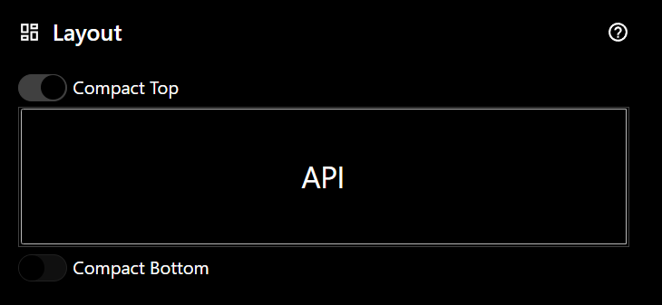

# Supplemental Custom API Documentation
## Using the Custom API
Currently, to use the Custom API the LED Ticker must be configured using the built-in web application to display the custom API ticker.  After initial configuration of your LED Ticker, use the web application to configure Settings/Display/Layout and select "API" to display in one or more of the custom panels.  To simplify this documentation, the rest of the documentation assumes that you have configured the entire display for API.  The resulting configuration looks like this in the Web app:

## Understanding the LED Grid
The LED Ticker is made up of a grid of LEDs (64x by 32y) with zero-based coordinates beginning at the upper left corner of the panel.  x and y values follow the pattern shown below where 0 is the upper left LED on the screen:

| | y|||||
|-|-|-|-|-|-|
|<b>x|0|1|2|3|<i>n|
||1|
||2|
||3|
||<i>n|

## Understanding Text Elements

### Sizes
Valid size values range from 1 to 4 with 1 being the smallest available text size and 4 being the largest available text size. The sizes have the following characteristics:

- Size 1
  - character height in y: 4-5 LEDs high and possibly 1 LED below the element's y value (for j,g,p,q,y).
    - UPPERCASE: always 5 LEDs high
    - lowercase: 4 or 5 LEDs high, and up to 1 below the element's y value
    - total possible height: 6 LEDs
  - character width in x: 3 LEDs wide
  - Full Screen Maximum UPPERCASE rows with no overlap/contiguous:  5
  - Full Screen Maximum lowercase or mixed rows with no overlap/contiguous: 4
- Size 2
  - character height in y:
    - UPPERCASE: always 7 LEDs high
    - lowercase: 5-7 LEDs high and up to 1 below the element's y value (for g,p,q,y)
    - total possible height: 8 LEDs
  - character width in x:
    - UPPERCASE: 5 LEDS wide EXCEPT I and 1 which are both 3 LEDs wide
    - lowercase: 4-5 LEDs wide
  - Full Screen Maximum UPPERCASE rows with no overlap/contiguous: 4
  - Full Screen Maximum lowercase or mixed rows with no overlap/contiguous: 3
- Size 3
  - character height in y:
    - UPPERCASE: Always 10 LEDs high
    - lowercase: 7-10 LEDs high and up to 1 below the element's y value (for j,g,p,q,y)
  - character width in x:
    - UPPERCASE: 6 LEDs wide EXCEPT M, N, and W (7)
    - lowercase: 5 LEDs wide EXCEPT i (2), l (4), t (6)
    - numerals: 6 LEDs wide EXCEPT 1 (4)
  - Full Screen Maximum UPPERCASE rows with no overlap/contiguous: 3
  - Full Screen Maximum lowercase or mixed rows with no overlap/contiguous: 2
- Size 4
  - character height in y:
    - UPPERCASE: Always 14 LEDs High
    - lowercase: 10-14 LEDs high and up to 2 below the element's y value (for g,p,q,y)
  - character width in x:
    - UPPERCASE: 10 LEDs wide except I (6)
    - lowercase:
    - numerals: 10 LEDs wide except 1 (6)
  - Full Screen Maximum UPPERCASE rows with no overlap/contiguous: 2
  - Full Screen Maximum lowercase or mixed rows with no overlap/contiguous: 2

### Alignment
Alignment is relative to the specified x value.  Your text will be left justified (L), right justified (R), or centered starting from the specified x value.

## Understanding Alignment
Applies to text and pixel line elements
Alignment is